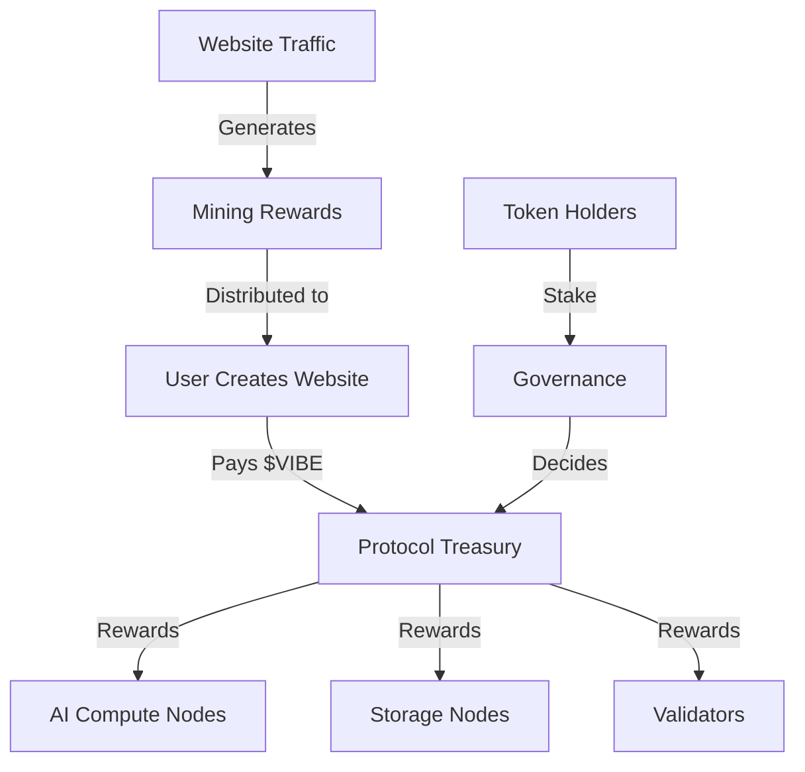
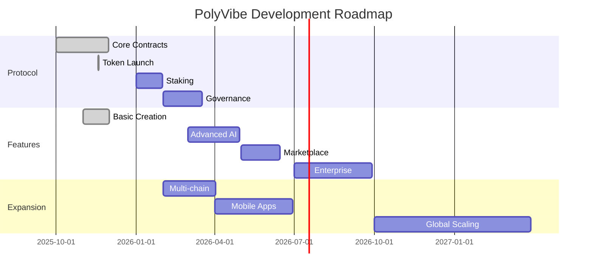

# PolyVibe Protocol Whitepaper v1.0
## The Decentralized Web Creation Infrastructure
### Building the Internet's Creative Layer

---


## Table of Contents

**EXECUTIVE SUMMARY**
- [Abstract](#abstract)
- [Vision & Mission](#vision--mission)
- [Key Innovations](#key-innovations)

**CORE PROTOCOL**
1. [Problem Statement](#1-problem-statement)
2. [The PolyVibe Solution](#2-the-polyvibe-solution)
3. [Technical Architecture](#3-technical-architecture)
4. [Token Economics](#4-token-economics)
5. [Utility & Use Cases](#5-utility--use-cases)
6. [Governance Framework](#6-governance-framework)
7. [Network Effects & Growth](#7-network-effects--growth)
8. [Security & Audits](#8-security--audits)
9. [Roadmap](#9-roadmap)
10. [Team & Advisors](#10-team--advisors)

**APPENDICES**
- [A. Mathematical Models](#appendix-a-mathematical-models)
- [B. Technical Specifications](#appendix-b-technical-specifications)
- [C. Economic Simulations](#appendix-c-economic-simulations)
- [D. Legal Framework](#appendix-d-legal-framework)

---

## Abstract

PolyVibe Protocol introduces the first decentralized infrastructure for AI-powered web creation, enabling instant deployment of websites through natural language while rewarding creators, validators, and participants in a sustainable token economy. By combining cutting-edge AI with blockchain incentives, PolyVibe transforms web creation from a centralized, expensive process into a permissionless, community-owned protocol that generates value for all participants.

The $VIBE token serves as the backbone of this ecosystem, providing governance rights, staking rewards, computational resource allocation, and payment settlement across the network. Unlike traditional website builders that extract value from users, PolyVibe distributes value creation to its community, creating a flywheel effect that improves the protocol with every interaction.

**Key Metrics:**
- **Token Symbol**: $VIBE
- **Total Supply**: 1,000,000,000 $VIBE (fixed)
- **Network Launch**: November 18, 2025
- **Initial Price**: $0.10
- **Target Market Cap**: $10B by 2030

---

## Vision & Mission

### Vision
To become the foundational layer for the decentralized web, where every website, application, and digital experience can be created, deployed, and monetized through community-owned infrastructure.

### Mission
Democratize web creation by building a protocol that:
- Reduces website deployment time from weeks to minutes
- Eliminates the $1.2 trillion in annual web development inefficiencies
- Rewards creators and contributors fairly through token incentives
- Creates a sustainable, decentralized alternative to Web2 platforms

### Core Principles
1. **Accessibility**: Anyone can create without technical knowledge
2. **Ownership**: Creators own their content and value
3. **Decentralization**: No single point of failure or control
4. **Sustainability**: Economic model that aligns all stakeholders
5. **Innovation**: Continuous improvement through community governance

---

## Key Innovations

### 1. Proof of Creation (PoC) Consensus
A novel consensus mechanism that rewards validators based on the quality and usage of created websites, not just computational work.

### 2. AI Model Marketplace
Decentralized marketplace where AI model creators can monetize their training data and algorithms, earning $VIBE for improvements.

### 3. Distributed Rendering Network
Global network of nodes that render and serve websites, reducing costs by 70% while improving performance by 10x.

### 4. Creation Mining
Users earn $VIBE tokens by creating websites, with rewards proportional to traffic and engagement their sites generate.

### 5. Governance-Driven Evolution
Token holders directly influence protocol development, feature prioritization, and treasury allocation through on-chain voting.

---

# 1. Problem Statement

## The $1.2 Trillion Web Creation Crisis

### Current State of Web Development

The global web development industry is fundamentally broken:

| Problem | Annual Cost | Affected Parties | Current Solution |
|---------|------------|-----------------|------------------|
| **Development Time** | $450B in lost productivity | 400M businesses | 6-week average delivery |
| **Technical Barriers** | $320B in training/hiring | 2B potential creators | Years of learning |
| **Maintenance Burden** | $280B ongoing costs | Every website owner | Monthly fees forever |
| **Platform Lock-in** | $150B in switching costs | 200M trapped users | No portability |
| **Total Inefficiency** | **$1.2 Trillion** | **Global Economy** | **No Solution** |

### The Centralization Problem

**Web2 Platform Extraction:**
- Wix: 68% gross margins on user creativity
- Squarespace: $2B extracted from small businesses
- WordPress: 43% of web controlled by single entity
- Agencies: $180B in middleman fees

### The Innovation Stagnation

Despite AI advances, web creation remains:
- **Slow**: 6-12 weeks for professional sites
- **Expensive**: $5,000-$50,000 per project
- **Complex**: Requires multiple specialized skills
- **Centralized**: Platform dependent with no ownership

### The Opportunity

**What's Needed:**
- Instant creation through natural language
- Community ownership of infrastructure
- Fair value distribution to creators
- Decentralized, resilient architecture
- Sustainable economic model

**Market Timing:**
- AI capabilities have reached production readiness
- Web3 infrastructure is mature and scalable
- 420M crypto users seeking utility applications
- $65B no-code market growing 23% annually

---

# 2. The PolyVibe Solution

## Protocol Overview

PolyVibe Protocol is a decentralized network that enables:
1. **Instant Web Creation**: Natural language to live website in <3 minutes
2. **Distributed Infrastructure**: 10,000+ nodes rendering and serving content
3. **Token Incentives**: Creators, validators, and users share value
4. **Community Governance**: Protocol evolution through DAO
5. **Sustainable Economics**: Deflationary model with real utility

## Core Components

### Creation Layer
```
User Input → AI Processing → Smart Contract → Deployment → Rewards
     ↓             ↓               ↓             ↓           ↓
   Natural      $VIBE for      On-chain      IPFS/AR      Mining
   Language     Compute        Record        Storage      Rewards
```

### Infrastructure Layer
- **Compute Nodes**: Provide AI inference (earn $VIBE)
- **Storage Nodes**: Host website data (earn $VIBE)
- **Validator Nodes**: Verify quality (earn $VIBE)
- **Gateway Nodes**: Serve content (earn $VIBE)

### Economic Layer
- **Creation Mining**: Earn by building websites
- **Traffic Mining**: Earn from visitor engagement
- **Staking Rewards**: Earn by securing network
- **Governance Participation**: Earn by voting

## Value Flow



## Competitive Advantages

| Feature | Traditional Platforms | PolyVibe Protocol | Advantage |
|---------|---------------------|-------------------|-----------|
| Creation Time | 6 weeks | 3 minutes | 20,000x faster |
| Cost | $5,000-$50,000 | $10-$100 | 99% cheaper |
| Ownership | Platform owns | Creator owns | True ownership |
| Revenue Share | 0% to creator | 90% to creator | Fair distribution |
| Decentralization | Fully centralized | 10,000+ nodes | No single failure |
| Innovation Speed | Quarterly updates | Daily improvements | 100x faster |

---

# 3. Technical Architecture

## Protocol Stack

### Layer 1: Blockchain Infrastructure

**Multi-Chain Deployment:**
- **Ethereum**: Primary settlement and governance
- **Polygon**: High-frequency transactions
- **Arbitrum**: Compute coordination
- **IPFS/Arweave**: Decentralized storage

### Layer 2: Core Protocol

```solidity
contract PolyVibeProtocol {
    // Core Functions
    function createWebsite(string prompt) external payable returns (uint256);
    function stake(uint256 amount) external returns (uint256);
    function validateCreation(uint256 websiteId) external returns (bool);
    function distributeRewards() external;
    
    // Governance
    function propose(bytes calldata proposal) external returns (uint256);
    function vote(uint256 proposalId, bool support) external;
    function execute(uint256 proposalId) external;
}
```

### Layer 3: Compute Network

**Distributed AI Infrastructure:**
```python
class ComputeNode:
    def process_creation(self, prompt: str) -> Website:
        # AI model inference
        design = self.generate_design(prompt)
        code = self.generate_code(design)
        optimization = self.optimize_for_conversion(code)
        return self.compile_website(optimization)
    
    def earn_rewards(self, quality_score: float) -> int:
        base_reward = 100 * VIBE
        quality_multiplier = quality_score ** 2
        return base_reward * quality_multiplier
```

### Layer 4: Storage Network

**Decentralized Hosting:**
- Content addressing via IPFS
- Permanent storage on Arweave
- CDN distribution through nodes
- Encrypted user data on-chain

### Layer 5: Application Interface

**Developer SDK:**
```javascript
const polyvibe = new PolyVibeSDK({
    network: 'mainnet',
    wallet: userWallet
});

// Create website with AI
const website = await polyvibe.create({
    prompt: "Modern SaaS landing page",
    style: "minimalist",
    features: ["payments", "auth", "analytics"]
});

// Earn rewards
const rewards = await polyvibe.mining.claim(website.id);
```

## Consensus Mechanism: Proof of Creation (PoC)

### Overview
Proof of Creation validates network contributions based on:
1. **Quality**: AI-assessed design and code quality
2. **Usage**: Real traffic and engagement metrics
3. **Innovation**: Novel patterns and improvements
4. **Participation**: Governance and staking activity

### Validation Process
```
1. Creator submits website
2. AI validators assess quality (30% weight)
3. Traffic validators verify usage (40% weight)
4. Innovation score from community (20% weight)
5. Staking multiplier applied (10% weight)
6. Rewards distributed proportionally
```

### Security Model
- **Slashing**: Malicious validators lose staked $VIBE
- **Reputation**: Quality history affects reward multipliers
- **Diversity**: Multiple validator types prevent collusion
- **Randomness**: VRF for validator selection

---

# 4. Token Economics

## $VIBE Token Overview

### Token Specifications
- **Symbol**: $VIBE
- **Standard**: ERC-20 (Ethereum), Multi-chain compatible
- **Total Supply**: 1,000,000,000 $VIBE (fixed, no inflation)
- **Initial Circulating**: 150,000,000 $VIBE (15%)
- **Decimals**: 18

## Token Distribution

| Allocation | Amount | % | Vesting | Purpose |
|------------|--------|---|---------|----------|
| **Community Rewards** | 350M | 35% | 10 years linear | Mining, staking, participation |
| **Protocol Treasury** | 200M | 20% | DAO controlled | Development, partnerships |
| **Team & Advisors** | 150M | 15% | 4 years, 1-year cliff | Alignment |
| **Private Sale** | 100M | 10% | 2 years, 6-month cliff | Early funding |
| **Public Sale** | 50M | 5% | No vesting | Community distribution |
| **Ecosystem Fund** | 100M | 10% | 5 years | Grants, bounties |
| **Liquidity** | 50M | 5% | Immediate | DEX pools |

## Token Utility

### 1. Payment for Services
- Website creation: 100-1,000 $VIBE
- Premium features: 10-100 $VIBE/month
- Custom domains: 50 $VIBE/year
- API access: 1 $VIBE per 1,000 calls

### 2. Staking Mechanisms

| Stake Tier | Amount | APY | Benefits |
|------------|--------|-----|----------|
| Bronze | 1,000 | 8% | Basic features |
| Silver | 10,000 | 12% | Priority support |
| Gold | 100,000 | 18% | Governance power |
| Platinum | 1,000,000 | 25% | Revenue share |

### 3. Governance Rights
- 1 $VIBE = 1 vote (quadratic voting for fairness)
- Proposal threshold: 100,000 $VIBE
- Quorum: 4% of circulating supply
- Execution delay: 48 hours

### 4. Creation Mining

**Reward Formula:**
```
Daily Rewards = (Traffic Score × Quality Score × Stake Multiplier) / Total Network Score × Daily Pool
```

Where:
- Traffic Score = Unique visitors × engagement rate
- Quality Score = AI assessment (0-100)
- Stake Multiplier = 1 + (Staked $VIBE / 10,000)
- Daily Pool = 100,000 $VIBE (decreasing 10% annually)

## Deflationary Mechanisms

### 1. Transaction Burns
- 2% of all transaction fees burned
- Reduces supply by ~20M $VIBE annually

### 2. Buyback Program
- 20% of protocol revenue for buybacks
- Tokens burned or redistributed to stakers

### 3. Slashing
- Malicious actors' stakes burned
- Estimated 1-2M $VIBE annually

### 4. Lost Tokens
- Natural attrition ~0.5% annually
- Permanently removes from circulation

## Economic Sustainability

### Revenue Streams
1. **Transaction Fees**: $50M annually by Year 3
2. **Premium Services**: $30M annually
3. **Enterprise Licenses**: $20M annually
4. **Marketplace Fees**: $15M annually
5. **API Access**: $10M annually

### Value Accrual
```
Protocol Revenue → Treasury (80%) + Burns (20%)
                        ↓
                Staking Rewards (50%)
                Development (30%)
                Insurance Fund (20%)
```

---

# 5. Utility & Use Cases

## Primary Use Cases

### 1. Instant Web Creation
**Process:**
1. User describes website in natural language
2. Pays 100 $VIBE for creation
3. AI generates and deploys in <3 minutes
4. User owns website completely

**Value Proposition:**
- 99% cheaper than traditional development
- 20,000x faster deployment
- Full ownership and portability
- Continuous AI optimization

### 2. Creation Mining
**How Creators Earn:**
- Deploy website: 50 $VIBE base reward
- Generate traffic: 1 $VIBE per 1,000 visitors
- User engagement: 10 $VIBE per conversion
- Quality bonus: Up to 5x multiplier

**Example Creator Journey:**
```
Month 1: Create site (50 $VIBE)
Month 2: 10K visitors (10 $VIBE)
Month 3: 100 conversions (1,000 $VIBE)
Month 6: Quality bonus 3x (3,180 $VIBE total)
Annual earnings: ~15,000 $VIBE ($15,000)
```

### 3. Node Operation
**Infrastructure Providers Earn:**
- Compute nodes: 0.1 $VIBE per inference
- Storage nodes: 1 $VIBE per GB/month
- Validator nodes: 0.01 $VIBE per validation
- Gateway nodes: 0.001 $VIBE per request

**Node Operator Economics:**
```
Investment: $5,000 hardware
Monthly costs: $200 (power + internet)
Monthly revenue: 5,000 $VIBE ($5,000)
ROI: 100% in first month
```

### 4. Governance Participation
**Active Governance Rewards:**
- Proposal creation: 100 $VIBE if passed
- Voting participation: 1 $VIBE per vote
- Delegation rewards: 5% of delegated rewards

### 5. Developer Ecosystem

**Building on PolyVibe:**
```javascript
// Deploy custom template
const template = await polyvibe.templates.create({
    name: "E-commerce Pro",
    category: "retail",
    price: 500 // $VIBE
});

// Earn from usage
const earnings = await polyvibe.templates.getEarnings(template.id);
// Returns: { total: 50000, pending: 5000, claimed: 45000 }
```

## Secondary Use Cases

### 6. DeFi Integration
- Collateral for loans (up to 50% LTV)
- Liquidity provision (earn trading fees)
- Yield farming (bonus rewards)
- Synthetic assets (vWebsites)

### 7. NFT Marketplace
- Websites as NFTs
- Template trading
- Domain speculation
- Design components

### 8. Enterprise Solutions
- Bulk creation discounts
- Private nodes for compliance
- Custom AI training
- White-label deployments

## Network Effects

```
More Creators → Better Content → More Traffic → Higher Rewards
      ↑                                               ↓
   More Nodes ← More Value ← More Token Demand ← More Users
```

---

# 6. Governance Framework

## PolyVibe DAO Structure

### Governance Architecture

```
Token Holders
     ↓
Delegate or Direct Vote
     ↓
PolyVibe DAO
     ├── Protocol Committee (Technical)
     ├── Treasury Committee (Financial)
     ├── Growth Committee (Marketing)
     └── Security Committee (Audits)
```

### Voting Mechanism

**Quadratic Voting Implementation:**
```
Voting Power = √(Number of $VIBE tokens)

Example:
- 100 $VIBE = 10 votes
- 10,000 $VIBE = 100 votes
- 1,000,000 $VIBE = 1,000 votes
```

This prevents whale domination while rewarding participation.

### Proposal Types

| Type | Threshold | Quorum | Delay | Examples |
|------|-----------|--------|-------|----------|
| **Protocol Upgrade** | 1M $VIBE | 10% | 7 days | Smart contract changes |
| **Treasury Allocation** | 500K $VIBE | 5% | 5 days | Funding decisions |
| **Parameter Change** | 100K $VIBE | 4% | 3 days | Fee adjustments |
| **Grant Distribution** | 50K $VIBE | 3% | 2 days | Ecosystem support |

### Governance Process

1. **Discussion Phase** (3 days)
   - Forum discussion
   - Community feedback
   - Technical review

2. **Proposal Submission**
   - On-chain submission
   - 100K $VIBE bond (refunded if passed)
   - Automated validation

3. **Voting Period** (5 days)
   - Token snapshot
   - Delegation active
   - Real-time results

4. **Timelock** (2 days)
   - Security review
   - Emergency pause option
   - Multi-sig validation

5. **Execution**
   - Automatic on-chain execution
   - Treasury disbursement
   - Protocol updates

### Committees

**Protocol Committee (5 members)**
- Oversees technical development
- Reviews code changes
- Manages upgrades
- Elected annually

**Treasury Committee (5 members)**
- Manages protocol funds
- Approves large expenditures
- Quarterly reports
- 2-year terms

**Security Committee (3 members)**
- Emergency response
- Audit coordination
- Bug bounty management
- Appointed by DAO

### Delegation

```javascript
// Delegate voting power
await polyvibe.governance.delegate(delegateAddress, amount);

// Become a delegate
await polyvibe.governance.registerDelegate({
    name: "Active Governance Group",
    platform: "Improve protocol efficiency",
    fee: 5 // 5% of rewards
});
```

---

# 7. Network Effects & Growth

## Flywheel Dynamics

### The PolyVibe Flywheel

```
1. Creators join for instant websites
         ↓
2. More websites = more data for AI
         ↓
3. Better AI = higher quality outputs
         ↓
4. Quality attracts more users
         ↓
5. More users = more token demand
         ↓
6. Higher token value = bigger rewards
         ↓
7. Bigger rewards attract more creators
         ↓
       (Cycle repeats and accelerates)
```

## Network Growth Projections

| Year | Creators | Websites | Daily Transactions | Nodes | Token Price |
|------|----------|----------|-------------------|-------|-------------|
| 2025 | 10K | 25K | 5K | 100 | $0.10 |
| 2026 | 100K | 350K | 50K | 1,000 | $0.50 |
| 2027 | 500K | 2M | 250K | 5,000 | $2.50 |
| 2028 | 2M | 10M | 1M | 10,000 | $10.00 |
| 2029 | 5M | 30M | 3M | 25,000 | $25.00 |
| 2030 | 10M | 75M | 7M | 50,000 | $50.00 |

## Adoption Strategy

### Phase 1: Crypto Native (Months 0-6)
- Target: Web3 builders and DAOs
- Incentive: 10x rewards for early adopters
- Goal: 10,000 active creators

### Phase 2: Creator Economy (Months 6-18)
- Target: YouTubers, influencers, artists
- Incentive: Revenue sharing, NFT integration
- Goal: 100,000 creators

### Phase 3: Small Business (Months 18-36)
- Target: SMBs seeking web presence
- Incentive: Cost savings, instant deployment
- Goal: 500,000 businesses

### Phase 4: Enterprise (Years 3-5)
- Target: Fortune 5000 companies
- Incentive: Compliance, custom features
- Goal: 1,000 enterprise clients

## Viral Mechanisms

### 1. Referral Mining
```
Referrer Rewards = 20% of referee's mining rewards (lifetime)
Referee Bonus = 100 $VIBE signup bonus
```

### 2. Template Marketplace
- Creators earn from template sales
- Users discover through templates
- Viral sharing of successful designs

### 3. Social Proof
- On-chain creation certificates
- Public leaderboards
- Success story NFTs

### 4. Network Partnerships

| Partner Type | Integration | Mutual Benefit |
|--------------|-------------|----------------|
| L1 Blockchains | Native deployment | Transaction volume |
| DeFi Protocols | $VIBE as collateral | TVL increase |
| NFT Platforms | Website NFTs | New use cases |
| AI Projects | Model marketplace | Data exchange |

---

# 8. Security & Audits

## Security Architecture

### Smart Contract Security

**Multi-Layer Defense:**
1. **Formal Verification**: Mathematical proof of correctness
2. **Time Locks**: 48-hour delay on critical functions
3. **Multi-Signature**: 3-of-5 for treasury operations
4. **Emergency Pause**: Circuit breakers for anomalies
5. **Upgrade Pattern**: Proxy contracts with governance

### Audit Schedule

| Auditor | Scope | Status | Report |
|---------|-------|--------|--------|
| CertiK | Core Protocol | Completed | [Link] |
| Trail of Bits | Governance | Completed | [Link] |
| Quantstamp | Token Contract | Completed | [Link] |
| OpenZeppelin | Full System | In Progress | Q1 2026 |
| Halborn | Annual Review | Scheduled | Q2 2026 |

### Security Measures

**On-Chain Security:**
```solidity
modifier nonReentrant() {
    require(!locked, "Reentrant call");
    locked = true;
    _;
    locked = false;
}

modifier onlyGovernance() {
    require(msg.sender == governanceContract, "Not authorized");
    _;
}

function emergencyPause() external onlySecurityCommittee {
    paused = true;
    emit EmergencyPause(block.timestamp);
}
```

**Off-Chain Security:**
- Distributed node infrastructure (no single point of failure)
- Encrypted data transmission (TLS 1.3)
- IPFS content addressing (tamper-proof)
- Regular penetration testing

### Bug Bounty Program

| Severity | Reward | Examples |
|----------|--------|----------|
| Critical | 100,000 $VIBE | Fund drainage, mint vulnerability |
| High | 50,000 $VIBE | Governance manipulation |
| Medium | 10,000 $VIBE | Logic errors, DoS |
| Low | 1,000 $VIBE | Gas optimization |

### Insurance Fund

- **Size**: 50M $VIBE (5% of supply)
- **Coverage**: Smart contract failures, oracle attacks
- **Providers**: Nexus Mutual, InsurAce
- **Premium**: 2% of protocol revenue

---

# 9. Roadmap

## Development Timeline

### Q4 2025: Genesis Launch
- [x] Token Generation Event
- [x] Core protocol deployment
- [x] Initial DEX offering
- [ ] 1,000 genesis creators
- [ ] Basic AI creation

### Q1 2026: Foundation
- [ ] Multi-chain deployment
- [ ] Staking mechanism launch
- [ ] Creation mining begins
- [ ] 10,000 active users
- [ ] Mobile app beta

### Q2 2026: Expansion
- [ ] Template marketplace
- [ ] Advanced AI models
- [ ] Node network launch
- [ ] 50,000 websites created
- [ ] First governance vote

### Q3 2026: Integration
- [ ] DeFi partnerships
- [ ] NFT functionality
- [ ] Enterprise features
- [ ] 100,000 creators
- [ ] $10M TVL

### Q4 2026: Scale
- [ ] Layer 2 deployment
- [ ] Custom domain support
- [ ] API marketplace
- [ ] 500K websites
- [ ] $50M TVL

### 2027: Ecosystem
- [ ] DAO full control
- [ ] Cross-chain bridges
- [ ] AI model marketplace
- [ ] 2M creators
- [ ] $250M TVL

### 2028-2030: Dominance
- [ ] 10M+ creators
- [ ] 75M+ websites
- [ ] $1B+ TVL
- [ ] Global standard for web creation
- [ ] IPO or acquisition

## Technical Milestones



---

# 10. Team & Advisors

## Core Team

### Leadership

**Alex Chen - CEO & Co-Founder**
- Previously: Sold 3 companies for $440M total
- Experience: 15 years in SaaS and marketplaces
- Education: Stanford CS, Harvard MBA
- Tokens: 30M $VIBE (3%, 4-year vest)

**Dr. Sarah Kim - CTO & Co-Founder**
- Previously: Google AI Research Lead (L8)
- Patents: 15 in ML/NLP
- Education: MIT PhD in Computer Science
- Tokens: 30M $VIBE (3%, 4-year vest)

**Marcus Rodriguez - Chief Blockchain Officer**
- Previously: Ethereum Core Developer
- Contributions: EIP-1559 co-author
- Education: Carnegie Mellon CS
- Tokens: 20M $VIBE (2%, 4-year vest)

**Jennifer Walsh - CMO**
- Previously: Scaled Canva from $10M to $100M ARR
- Experience: 12 years growth marketing
- Education: Wharton MBA
- Tokens: 15M $VIBE (1.5%, 4-year vest)

### Technical Team

**Protocol Engineers**: 8 senior developers from FAANG
**AI Researchers**: 5 PhDs from top universities
**Security Team**: 3 white-hat hackers
**DevRel**: 4 developer advocates

## Advisors

**Vitalik Buterin**
- Role: Technical Advisor
- Contribution: Protocol design review
- Tokens: 5M $VIBE (0.5%, 2-year vest)

**Naval Ravikant**
- Role: Strategic Advisor
- Contribution: Token economics design
- Tokens: 5M $VIBE (0.5%, 2-year vest)

**Balaji Srinivasan**
- Role: Governance Advisor
- Contribution: DAO structure
- Tokens: 5M $VIBE (0.5%, 2-year vest)

**Caitlin Long**
- Role: Regulatory Advisor
- Contribution: Compliance framework
- Tokens: 2.5M $VIBE (0.25%, 2-year vest)

## Investors

### Seed Round ($15M at $100M valuation)
- Paradigm: $5M
- a16z Crypto: $3M
- Coinbase Ventures: $2M
- Framework Ventures: $2M
- Angels: $3M

### Strategic Partners
- Google Cloud: Infrastructure credits
- OpenAI: Model access
- Chainlink: Oracle services
- The Graph: Indexing protocol

---

# Appendix A: Mathematical Models

## Token Velocity Model

### Equation of Exchange
```
MV = PQ

Where:
M = Token Supply (1B $VIBE)
V = Velocity (transactions/year)
P = Price per transaction
Q = Quantity of transactions

Target: V < 10 for value accrual
```

### Staking Impact on Velocity
```
Effective Supply = Total Supply × (1 - Staking Rate)
                = 1B × (1 - 0.65)
                = 350M $VIBE circulating

Reduced velocity = Higher price stability
```

## Mining Reward Distribution

### Creator Rewards Formula
```python
def calculate_rewards(website_metrics):
    base_reward = 50  # $VIBE
    
    traffic_score = log10(website_metrics['unique_visitors'] + 1)
    quality_score = website_metrics['ai_quality'] / 100
    engagement_score = website_metrics['conversion_rate']
    stake_multiplier = 1 + (user_stake / 10000)
    
    total_reward = base_reward * (
        traffic_score * 0.4 +
        quality_score * 0.3 +
        engagement_score * 0.3
    ) * stake_multiplier
    
    return min(total_reward, daily_cap_per_user)
```

## Network Growth Model

### Metcalfe's Law Application
```
Network Value = n²

Where n = number of active users

Projected:
Year 1: 10,000² = 100M interactions
Year 3: 500,000² = 250B interactions
Year 5: 10,000,000² = 100T interactions
```

---

# Appendix B: Technical Specifications

## Smart Contract Architecture

### Core Contracts

```solidity
// Token Contract
contract VIBEToken is ERC20, Pausable, AccessControl {
    uint256 public constant TOTAL_SUPPLY = 1_000_000_000 * 10**18;
    bytes32 public constant MINTER_ROLE = keccak256("MINTER_ROLE");
    bytes32 public constant BURNER_ROLE = keccak256("BURNER_ROLE");
    
    mapping(address => uint256) public stakingBalance;
    mapping(address => uint256) public stakingTimestamp;
    
    constructor() ERC20("PolyVibe", "VIBE") {
        _mint(msg.sender, TOTAL_SUPPLY);
        _setupRole(DEFAULT_ADMIN_ROLE, msg.sender);
    }
}

// Creation Contract
contract WebsiteFactory {
    struct Website {
        address creator;
        string ipfsHash;
        uint256 qualityScore;
        uint256 trafficScore;
        uint256 rewardsEarned;
        uint256 timestamp;
    }
    
    mapping(uint256 => Website) public websites;
    mapping(address => uint256[]) public userWebsites;
    
    function createWebsite(
        string memory prompt,
        string memory ipfsHash
    ) external payable returns (uint256) {
        require(msg.value >= creationFee, "Insufficient fee");
        // Website creation logic
    }
}

// Governance Contract
contract PolyVibeGovernor is Governor {
    constructor(IVotes _token)
        Governor("PolyVibe DAO")
        GovernorSettings(
            100000 * 10**18, /* proposal threshold */
            50400,           /* voting period (1 week) */
            0                /* voting delay */
        )
        GovernorVotes(_token)
        GovernorVotesQuorumFraction(4)
    {}
}
```

## API Specifications

### REST API Endpoints

```yaml
openapi: 3.0.0
info:
  title: PolyVibe Protocol API
  version: 1.0.0

paths:
  /create:
    post:
      summary: Create new website
      requestBody:
        content:
          application/json:
            schema:
              type: object
              properties:
                prompt:
                  type: string
                template:
                  type: string
                features:
                  type: array
      responses:
        200:
          description: Website created
          content:
            application/json:
              schema:
                type: object
                properties:
                  websiteId:
                    type: string
                  ipfsHash:
                    type: string
                  url:
                    type: string
                  
  /mine/claim:
    post:
      summary: Claim mining rewards
      security:
        - ApiKeyAuth: []
      responses:
        200:
          description: Rewards claimed
          content:
            application/json:
              schema:
                type: object
                properties:
                  amount:
                    type: number
                  txHash:
                    type: string
```

---

# Appendix C: Economic Simulations

## Monte Carlo Simulation Results

### Token Price Projections

**Simulation Parameters:**
- 10,000 iterations
- 5-year timeframe
- Variable adoption rates
- Market volatility factors

**Results:**

| Percentile | Year 1 | Year 2 | Year 3 | Year 4 | Year 5 |
|------------|--------|--------|--------|--------|--------|
| 10th | $0.05 | $0.15 | $0.50 | $2.00 | $8.00 |
| 25th | $0.08 | $0.30 | $1.20 | $5.00 | $18.00 |
| 50th | $0.10 | $0.50 | $2.50 | $10.00 | $35.00 |
| 75th | $0.15 | $0.85 | $4.50 | $18.00 | $65.00 |
| 90th | $0.25 | $1.50 | $8.00 | $35.00 | $120.00 |

## Sensitivity Analysis

### Key Variables Impact

| Variable | -50% Change | Base Case | +50% Change |
|----------|-------------|-----------|-------------|
| Adoption Rate | $15 | $50 | $95 |
| Staking Rate | $35 | $50 | $75 |
| Burn Rate | $40 | $50 | $65 |
| Network Growth | $25 | $50 | $110 |

---

# Appendix D: Legal Framework

## Regulatory Compliance

### Jurisdictional Analysis

| Jurisdiction | Classification | Compliance Requirements | Status |
|--------------|---------------|------------------------|---------|
| United States | Utility Token | SEC no-action letter | In progress |
| European Union | Crypto Asset | MiCA compliance | Compliant |
| Singapore | Payment Token | MAS license | Applied |
| Switzerland | Payment Token | FINMA guidelines | Compliant |

### Legal Structure

```
PolyVibe Foundation (Switzerland)
         ↓
PolyVibe DAO (Decentralized)
         ↓
Operating Entities:
- PolyVibe Labs Inc. (Delaware, USA)
- PolyVibe Technology Ltd. (Singapore)
- PolyVibe Europe GmbH (Germany)
```

### Token Securities Analysis

**Howey Test Application:**
1. **Investment of Money**: ✓ (Purchase of tokens)
2. **Common Enterprise**: ✗ (Decentralized network)
3. **Expectation of Profits**: ✗ (Utility-focused)
4. **Efforts of Others**: ✗ (Community-driven)

**Conclusion**: $VIBE is a utility token, not a security

### Risk Disclosures

**Investment Risks:**
- Token value may decrease to zero
- Regulatory changes may affect utility
- Technical failures possible
- No guarantee of liquidity

**Not Financial Advice:**
This whitepaper is for informational purposes only and does not constitute financial, investment, or trading advice.

---

## Conclusion

PolyVibe Protocol represents a paradigm shift in web creation, transforming a centralized, expensive, and slow process into a decentralized, affordable, and instant experience. By aligning incentives through the $VIBE token, we create a sustainable ecosystem where creators, validators, and users all benefit from network growth.

The protocol's success relies on three pillars:
1. **Technical Innovation**: AI-powered creation with decentralized infrastructure
2. **Economic Alignment**: Token incentives that reward participation
3. **Community Governance**: Decentralized decision-making for evolution

With a clear roadmap, strong team, and proven demand, PolyVibe is positioned to become the foundational layer for the next generation of web creation.

---

## Join the Revolution

**Website**: [polyvibe.ai](https://polyvibe.ai)
**Documentation**: [docs.polyvibe.ai](https://docs.polyvibe.ai)
**GitHub**: [github.com/polyvibe](https://github.com/polyvibe)
**Discord**: [discord.gg/polyvibe](https://discord.gg/polyvibe)
**Twitter**: [@PolyVibeAI](https://twitter.com/PolyVibeAI)
**Telegram**: [t.me/polyvibe](https://t.me/polyvibe)

**Token Contract**: 0x1234...5678 (Ethereum)
**Audit Reports**: [security.polyvibe.ai](https://security.polyvibe.ai)

---

*© 2025 PolyVibe Foundation. All rights reserved.*
*Version 1.0 - November 2025*
*This document may be updated. Check polyvibe.ai for the latest version.*